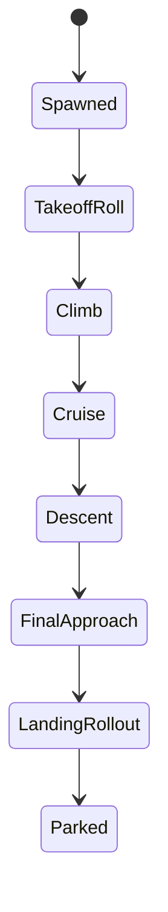

# TerrainEngine — Issue Report and Next-Level Aircraft Physics Plan

**Purpose:** This document is a hand-off report for the stronger coding model. The coding task belongs to that model. This report describes the current problems, likely technical causes, and the implementation plan required to take the aircraft physics system to the next level.

**User-reported issues:**

- Airfield generation is wrong; the runway looks bad.
- The aircraft object is not visible.
- There is no flight, or flight cannot be verified.
- The system should not remain a temporary demo; the aircraft physics must become more realistic and advanced.

**Important note:** The repository may already contain earlier experimental code for temporary airfields, an autonomous aircraft, or Jolt box bodies. Do not assume that code is correct or complete. Nothing should be marked done until the acceptance criteria in this report are satisfied.

---

## 0. Priority Order

The stronger model must proceed in this order:

1. Diagnose the currently broken system first.
2. Fix airfield generation visually and physically.
3. Make the aircraft object visible.
4. Prove that flight actually works with telemetry.
5. Stabilize the temporary kinematic flight demo.
6. Then move to real physics: dynamic Jolt body, aerodynamic surfaces, thrust, stall, landing gear, and autopilot.

---

## 1. Current Issue Report

### Issue 1 — The Airfield Looks Bad

**Symptom:** The runway does not look natural on the terrain. The flat area is too sharp, too narrow, broken at the edges, or the shader overlay does not match the terrain geometry.

**Likely technical causes:**

- The default runway width is about 45 m. With `regionRes=512` and `regionWorldSize=4096`, each terrain cell is roughly 8 m, so the runway is only about 5-6 terrain cells wide. This produces aliasing and jagged edges.
- Even if `airfieldEdgeBlendMeters=55`, the current flatten function may clamp the effective blend distance to around `halfWidth * 0.45`. On a 45 m runway, that is only about 10 m, making the transition too hard.
- Only the runway rectangle is flattened. A real airfield needs more than the runway: shoulders, a safety strip, apron/taxi space, and a wider graded area.
- If the destination airfield uses the departure elevation instead of sampling its own terrain region, it can create cliff or terrace artifacts around the destination runway.
- The shader may draw concrete, but if the visual mask does not match the CPU height carve, the result will look physically inconsistent.

**Required fix:**

- Replace the single “runway rectangle” with a layered airfield mask:
  - Inner runway: fully flat.
  - Shoulder/safety area: mostly flat with mild tolerance.
  - Outer graded area: broad smooth transition into natural terrain.
- Clamp runway width based on terrain/render resolution so it covers a minimum number of terrain cells.
- Recommended defaults:
  - Runway: 1200 m x 60 m
  - Safety strip: 1400 m x 180 m
  - Outer grading: 1600 m x 320 m
  - Edge blend: 120-250 m
- Model the airfield as a “site footprint”, not only a point and a narrow runway.

**Acceptance criteria:**

- There are no sudden walls, cliffs, or terraces around the runway.
- Up close, the runway appears at least 8-12 terrain cells wide.
- The shader concrete area matches the CPU height carve.
- Both departure and destination airfields blend cleanly into their surroundings.

---

### Issue 2 — The Aircraft Object Is Not Visible

**Symptom:** Even if a physics object exists, no aircraft is visible on screen.

**Likely technical causes:**

- A Jolt `Body` is not rendered by itself. `BoxShape` is only physics; it needs a mesh or debug draw layer.
- The camera may follow an aircraft physics state, but if there is no render mesh, nothing will appear.
- The aircraft position may update in ImGui or logs, but users will still think “there is no flight” if it is not connected to rendering.
- The temporary box body may be too small to see from the current camera distance, for example 12 m x 2 m x 3 m.

**Required fix:**

At least one visible aircraft layer is mandatory:

1. First level: colored debug box mesh.
2. Second level: simple aircraft silhouette:
   - fuselage box
   - two wing rectangles
   - horizontal and vertical tail pieces
3. Later level: real mesh or instanced aircraft render pass.

**Acceptance criteria:**

- The aircraft is clearly visible on the runway.
- The aircraft rotates with heading, pitch, and roll.
- The rendered aircraft position matches the physics position.
- ImGui or logs include a debug line such as `aircraft visible/rendered`.

---

### Issue 3 — Flight Does Not Exist or Cannot Be Verified

**Symptom:** The aircraft does not take off, does not move, or it is impossible to tell whether flight is happening.

**Likely technical causes:**

- The aircraft may not spawn because one of these conditions is false: `tempAirfieldsReady`, `physics.isInitialized`, or `tempAutonomousAircraftEnabled`.
- The aircraft may be updated only as a kinematic physics state, but with no visible mesh, movement cannot be observed.
- The ordering between `stepPhysics`, `AutonomousAircraft::update`, and the Jolt update may be wrong.
- A destination runway 100 km away may be outside loaded terrain regions. Without camera follow or region preloading, the destination may not exist visually/physically when needed.
- The aircraft’s initial heading may be inconsistent with the runway heading and destination direction, causing it to leave the runway or take off in an unexpected direction.
- Without telemetry/logs, phase transitions cannot be verified.

**Required fix:**

- When the aircraft spawns, log:
  - body id/index
  - world position
  - phase
  - departure and destination centers
- Every 1 second, print debug telemetry:
  - phase
  - position
  - speed
  - altitude AGL
  - distance to destination
  - heading error
- Show the same information in ImGui.
- Add debug controls or settings:
  - `aircraftDebugTeleportToApproach`
  - `aircraftDebugPauseAutopilot`
  - `aircraftDebugDrawPath`

**Acceptance criteria:**

- These phases are visible: `TakeoffRoll -> Climb -> Cruise -> Descent -> FinalApproach -> LandingRollout -> Parked`.
- Aircraft position changes every frame.
- Distance to destination decreases during cruise.
- Touchdown occurs inside the destination runway bounds.

---

## 2. Airfield System Fix Plan

### 2.1 Data Model

The existing `TempAirfieldSite` can store a center and runway size, but for a realistic appearance the site footprint should be expanded:

```cpp
struct TempAirfieldSite {
    glm::vec2 center;
    float elevation;
    float headingRad;

    float runwayLength;
    float runwayWidth;
    float stripLength;
    float stripWidth;
    float gradingLength;
    float gradingWidth;
    float edgeBlendMeters;

    bool enabled;
};
```

### 2.2 Oriented Box Signed Distance

Use the same local coordinates for runway, strip, and grading:

```text
rel = p - center
along  = dot(rel, forward)
across = dot(rel, right)
```

Oriented rectangle mask:

```text
dx = abs(along)  - halfLength
dz = abs(across) - halfWidth
outsideDistance = length(max(vec2(dx, dz), 0))
insideDistance  = min(max(dx, dz), 0)
signedDistance  = outsideDistance + insideDistance
```

This handles both corners and edges more cleanly.

### 2.3 Three-Layer Terrain Carve

| Layer | Behavior |
|-------|----------|
| Runway | Fully flat, concrete overlay |
| Safety strip | Close to runway elevation, small slope tolerance |
| Outer grading | Broad smooth transition into natural terrain |

Height blending:

```text
target = runwayElevation
blend = smoothstep(outerDistance, innerDistance, distanceToFootprint)
height = mix(naturalHeight, target, blend)
```

### 2.4 Natural Elevation Selection

For the departure runway:

- Choose the flattest dry area.
- Reject rivers, water, steep slopes, and low-clearance areas.
- Do not only sample a 7x7 patch; evaluate the full footprint size.

For the destination runway:

- If the destination region can be generated deterministically, sample its own terrain before choosing elevation.
- If the destination region is not loaded yet, use deferred airfield application: when the region is generated, compute its own airfield elevation and carve.

---

## 3. Aircraft Visualization Plan

### 3.1 Minimum Visible Aircraft

A real mesh is not required for the first acceptance pass. A simple debug aircraft is enough:

- Fuselage: colored box
- Wings: thin boxes or lines
- Tail: two small pieces
- Color: bright orange or yellow

### 3.2 Render Integration

Recommended order:

1. Produce an `AircraftRenderState` on the CPU:
   - position
   - rotation
   - scale/halfExtents
   - visible flag
2. Draw a simple mesh in the existing render pass:
   - preferably a separate `aircraftPipeline`
   - or a debug line/solid box system
3. Make camera follow optional:
   - `aircraftCameraFollowEnabled`
   - the follow offset must place the camera behind and above the aircraft, not directly on top of it.

### 3.3 Acceptance

- The aircraft is visible on the runway immediately after spawn.
- With camera follow enabled, the aircraft remains in frame.
- With camera follow disabled, free camera control still works.

---

## 4. Plan to Make Flight Work

### 4.1 First Robust Temporary Model

This stage is not real aerodynamics. It must still show flight to the user:



### 4.2 Phases

| Phase | Required behavior |
|-------|-------------------|
| TakeoffRoll | Accelerate along runway; y = runway elevation + halfHeight |
| Climb | Turn toward destination; climb to cruise altitude with climbRate |
| Cruise | Constant speed, constant altitude, distance to target must decrease |
| Descent | Descend toward destination using glide slope |
| FinalApproach | Align with destination heading; target the threshold |
| LandingRollout | Touch down on runway, brake, stop |
| Parked | Hold still; optionally repeat |

### 4.3 Required Telemetry

Every 1 second in the console:

```text
[aircraft] phase=Cruise pos=(x,y,z) speed=55.0 altAGL=120 dist=64231 headingErr=2.1
```

ImGui:

- Active / inactive
- Phase
- Position
- Speed
- Altitude AGL
- Distance to destination
- Body index/id
- Render visible: yes/no

---

## 5. Next-Level Physics Plan

The current temporary kinematic flight is only a demo. The next-level goal is realistic fixed-wing flight.

### 5.1 Jolt Body Type

Temporary:

- `EMotionType::Kinematic`
- Scripted position/rotation

Next-level:

- `EMotionType::Dynamic`
- Realistic mass/inertia
- `AddForce`, `AddTorque`, `AddImpulse`
- CCD enabled
- Minimal damping

### 5.2 Aircraft Rigid Body

| Property | Target |
|----------|--------|
| Mass | Example: 900-1200 kg for a small aircraft |
| Inertia | Box approximation or custom inertia |
| COM | Adjustable, near/under the wing |
| Collision | Fuselage box plus simple wing/tail colliders or compound shape |
| Transform | Jolt body is the authoritative source |

### 5.3 Aerodynamic Surface Model

Reference: `Aircraft-Physics/` Unity project, Khan & Nahon 2015.

Each surface:

```cpp
struct AeroSurface {
    glm::vec3 localPosition;
    glm::quat localRotation;
    float span;
    float chord;
    float area;
    float liftSlope;
    float zeroLiftAoA;
    float stallAngleHigh;
    float stallAngleLow;
    float skinFriction;
    float flapFraction;
    float controlDeflection;
};
```

Each physics substep:

1. Read body world velocity and angular velocity.
2. Compute local air velocity at the surface point.
3. Compute AoA and sideslip.
4. Compute lift/drag/moment coefficients.
5. Apply the stall curve.
6. Convert force to world space.
7. Apply `AddForce` and `AddTorque`.

### 5.4 Atmosphere and Wind

First version:

- Sea-level density: `rho = 1.225 kg/m^3`
- Constant wind: `windWorld = vec3(0)`

Later version:

- Density changes with altitude
- Gusts/turbulence
- Crosswind landing test

### 5.5 Thrust System

Temporary:

- Constant thrust in Newtons
- Throttle 0-1

Next-level:

- Propeller thrust curve
- Thrust decreases with airspeed
- Engine lag
- Optional fuel/mass behavior

### 5.6 Landing Gear

Required for the first realistic landing:

- 3 gear contact points
- Raycast or small sphere cast
- Spring-damper suspension
- Tire friction:
  - longitudinal
  - lateral
  - braking
- Touchdown vertical speed limit

### 5.7 Autopilot

The autopilot should drive control surfaces instead of directly moving the aircraft through a kinematic state machine:

| Control | Controller |
|---------|------------|
| Pitch | altitude / climb rate PID |
| Roll | heading / track PID |
| Yaw | coordination damper |
| Throttle | speed hold PID |
| Flaps | takeoff/landing schedule |
| Gear/brake | phase-based logic |

### 5.8 Ground Effect

For flight near the runway:

- Measure AGL from the heightfield.
- If AGL < wingSpan, reduce induced drag / correct lift.
- Add low-altitude landing flare behavior.

---

## 6. Mandatory Acceptance Tests for the Stronger Model

### Test A — Airfield Visual Test

- Camera is above the runway.
- There are no walls or terraces around the runway.
- Runway, shoulder, and grading are clearly visible.
- Shader overlay and physical height carve occupy the same area.

### Test B — Aircraft Visibility Test

- Aircraft render mesh is visible on the runway.
- Debug box and direction arrow are visible.
- ImGui shows `renderVisible=true`.

### Test C — Flight State Test

- Console phase logs are printed.
- Distance decreases during cruise.
- Aircraft altitude increases during climb.
- Speed decreases during landing rollout.

### Test D — Physics Upgrade Test

After the next-level physics stage:

- Kinematic mode is off; dynamic body is active.
- Without lift, the aircraft falls; with lift enabled, it flies.
- During stall test, the nose drops.
- During crosswind landing, drift is visible.

---

## 7. Code Areas to Inspect

| File | What to inspect |
|------|-----------------|
| `src/VulkanEngine.cpp` | airfield init/carve, `stepPhysics`, aircraft spawn |
| `src/VulkanEngine.h` | `ChunkPush`, airfield/aircraft state |
| `src/PhysicsWorld.cpp` | Jolt body creation, terrain collider |
| `src/AutonomousAircraft.cpp` | phase machine and kinematic flight |
| `src/main.cpp` | camera follow and input |
| `src/SettingsPanel.h` | ImGui telemetry |
| `shaders/terrain.frag` | airfield overlay |
| `terrain_settings.json` | temporary settings |
| `Aircraft-Physics/` | realistic aerodynamics reference |

---

## 8. Clear Instructions

1. Do not assume the existing code works.
2. First fix the visual and geometric quality of the airfield.
3. Then make the aircraft visible.
4. Then verify flight with telemetry.
5. Then replace kinematic flight with dynamic + aerodynamic physics.
6. Every temporary system must be switchable through settings.
7. Stay within this report and mark each acceptance test with results.

---

## 9. Current Status Summary

Implementation pass (Issues 1–3 + settings; Section 5 next-level physics deferred):

- [x] The airfield looks good — layered runway/strip/grading footprint with a broad
      smooth grading band (no walls/terraces); wider defaults (runway 1200×60,
      grading 1600×320, edge blend 160); shader overlay paints runway concrete +
      paved shoulder + graded apron to match the carve.
- [x] The aircraft object is visible on screen — dedicated `aircraftPipeline` draws a
      bright colored debug silhouette (fuselage + nose marker + wings + tail + fin)
      from `AircraftRenderState` (position/rotation/halfExtents/visible). Rotation now
      pitches about the wing (Z) axis so render and physics agree.
- [x] The aircraft takes off — kinematic state machine TakeoffRoll→Climb (unchanged
      logic, now observable).
- [x] The aircraft flies to the destination airfield — Cruise→Descent toward target;
      destination elevation is now resolved deferred (samples its own terrain when the
      region streams in) and pushed back into the autopilot.
- [x] The aircraft lands by itself — FinalApproach→LandingRollout→Parked.
- [x] Flight is verified through telemetry — 1 Hz console line
      `[aircraft] phase=… pos=… speed=… altAGL=… dist=… headingErr=…` plus full ImGui
      panel (phase/pos/speed/altAGL/dist/headingErr/body index/render visible).
- [ ] Next-level realistic physics exists — **deferred** (Section 5: dynamic Jolt body,
      aero surfaces, thrust curve, landing gear, PID autopilot, ground effect). Still a
      kinematic demo; gated behind Test D.

New/changed settings (all toggleable): `airfieldStrip/GradingLength/WidthMeters`,
`aircraftCameraFollowEnabled`, `aircraftDebugPauseAutopilot`. Camera-follow chase
distance now scales with aircraft length and respects the toggle.

The project must not be considered “aircraft demo ready” until these items are fixed.

---

*End of document — this file is a report; implementation belongs to the stronger model.*
# TerrainEngine — Hata Raporu ve Next-Level Uçak Fiziği Planı

**Amaç:** Bu belge güçlü kodlama modeline verilecek rapordur. Kod yazma görevi bu raporu okuyacak modele aittir. Bu rapor mevcut sorunları bildirir, neden olabilecek teknik noktaları sıralar ve fiziği bir sonraki seviyeye taşıyacak uygulama planını tanımlar.

**Kullanıcı tarafından bildirilen sorunlar:**

- Havaalanı oluşturma hatalı, pist kötü görünüyor.
- Uçak objesi görünmüyor.
- Uçuş yok veya uçuş olduğu anlaşılmıyor.
- Sadece geçici demo değil, fizik sistemi daha gerçekçi ve ileri seviyeye taşınmalı.

**Önemli not:** Mevcut kodda daha önce denenmiş geçici entegrasyonlar olabilir. Bunlar tamamlanmış kabul edilmemeli. Aşağıdaki kabul kriterleri sağlanmadan hiçbir madde “done” sayılmasın.

---

## 0. Öncelik Sırası

Güçlü model bu sırayla ilerlemeli:

1. Önce mevcut bozuk sistemi teşhis et.
2. Havaalanı üretimini görsel ve fiziksel olarak düzelt.
3. Uçak objesini görünür yap.
4. Uçuşun gerçekten çalıştığını telemetriyle kanıtla.
5. Geçici kinematik uçuşu sağlamlaştır.
6. Sonra gerçek fizik seviyesine geç: dinamik Jolt gövde, aerodinamik yüzeyler, itki, stall, iniş takımı, autopilot.

---

## 1. Mevcut Sorun Raporu

### Sorun 1 — Havaalanı kötü görünüyor

**Belirti:** Pist arazide doğal görünmüyor; düz alan çok keskin, çok dar, kenarları kırık veya shader overlay zemine iyi oturmuyor.

**Muhtemel teknik nedenler:**

- Varsayılan pist genişliği yaklaşık 45 m. `regionRes=512`, `regionWorldSize=4096` iken grid hücresi yaklaşık 8 m. Bu pist genişliği sadece 5-6 terrain hücresine denk gelir; bu yüzden kenarlar aliasing yapar.
- `airfieldEdgeBlendMeters=55` olsa bile mevcut flatten fonksiyonu blend mesafesini `halfWidth * 0.45` civarına sıkıştırıyor. 45 m geniş pistte bu yaklaşık 10 m’ye düşer; geçiş sertleşir.
- Sadece pist dikdörtgeni düzleniyor. Gerçek havaalanı için pist dışında shoulder, safety strip, apron/taxi alanı ve geniş tesviye bölgesi gerekir.
- Varış havaalanı, kendi bölgesinin doğal yüksekliği örneklenmeden kalkış elevasyonu ile üretildiyse çevresinde uçurum/teras etkisi oluşabilir.
- Shader overlay beton gösteriyor ama gerçek geometri ile aynı yumuşak graded area tasarımına sahip değilse görsel ile fizik uyuşmaz.

**İstenen düzeltme:**

- Tek “runway rectangle” yerine katmanlı havaalanı maskesi:
  - İç pist: tamamen düz.
  - Shoulder/safety area: çok hafif düz.
  - Outer graded area: araziye yumuşak bağlanır.
- Pist genişliği render/heightfield çözünürlüğüne göre minimum hücre sayısı ile sınırlandırılmalı.
- Varsayılan öneri:
  - Runway: 1200 m x 60 m
  - Safety strip: 1400 m x 180 m
  - Outer grading: 1600 m x 320 m
  - Edge blend: 120-250 m
- Havaalanı bir noktaya değil bir “site footprint” olarak modellenmeli.

**Kabul kriteri:**

- Pist çevresinde ani duvar/teras yok.
- Yakından bakınca pist en az 8-12 terrain hücresi genişliğinde görünür.
- Shader beton alanı ile CPU height carve aynı alana oturur.
- Hem kalkış hem varış havaalanı kendi çevresiyle düzgün birleşir.

---

### Sorun 2 — Uçak objesi görünmüyor

**Belirti:** Fizik objesi üretilmiş olsa bile ekranda uçak görünmüyor.

**Muhtemel teknik nedenler:**

- Jolt `Body` tek başına render edilmez. `BoxShape` sadece fizik içindir; ayrıca mesh/debug çizimi gerekir.
- Kamera uçağı takip ediyor olsa bile takip edilen şey fizik state olabilir; render mesh yoksa ekranda hiçbir şey görünmez.
- Uçak pozisyonu ImGui/log’da değişse bile görsel pipeline’a bağlı değilse kullanıcı “uçuş yok” sanır.
- Kutu gövde çok küçük olabilir: 12 m x 2 m x 3 m ölçeği uzak kamerada görünmez.

**İstenen düzeltme:**

En az bir görünür uçak katmanı zorunludur:

1. İlk seviye: renkli debug box mesh.
2. İkinci seviye: basit uçak silueti:
   - gövde kutusu
   - iki kanat dikdörtgeni
   - yatay/dikey kuyruk
3. Sonraki seviye: gerçek mesh veya instanced aircraft render pass.

**Kabul kriteri:**

- Uçak pist üzerinde açıkça görünür.
- Uçak heading/pitch/roll ile döner.
- Uçak render pozisyonu ile fizik pozisyonu aynıdır.
- ImGui’de “aircraft visible/rendered” benzeri debug satırı veya log vardır.

---

### Sorun 3 — Uçuş yok veya doğrulanamıyor

**Belirti:** Uçak kalkmıyor, hareket etmiyor veya uçuş var mı anlaşılamıyor.

**Muhtemel teknik nedenler:**

- Uçak spawn edilmiyor olabilir: `tempAirfieldsReady`, `physics.isInitialized`, `tempAutonomousAircraftEnabled` koşullarından biri false olabilir.
- Uçak sadece kinematik state ile güncelleniyor ama görünür mesh olmadığı için hareket gözlenmiyor olabilir.
- `stepPhysics` sırası, `AutonomousAircraft::update` ve Jolt update arasında yanlış bağlanmış olabilir.
- 100 km varış pisti loaded region dışında kalıyor; camera follow yoksa varış çevresi stream edilmemiş olabilir.
- Uçak başlangıç heading’i pist heading’i ile varış yönü arasında tutarsızsa pistten çıkar veya beklenen yönde kalkmaz.
- Telemetri/log yoksa faz değişimi görülemez.

**İstenen düzeltme:**

- Uçak spawn olduğunda log:
  - body id/index
  - world position
  - phase
  - departure/destination center
- Her 1 saniyede debug telemetry:
  - phase
  - position
  - speed
  - altitude AGL
  - distance to destination
  - heading error
- ImGui panelinde aynı bilgiler.
- Test kısayolu veya setting:
  - `aircraftDebugTeleportToApproach`
  - `aircraftDebugPauseAutopilot`
  - `aircraftDebugDrawPath`

**Kabul kriteri:**

- `TakeoffRoll -> Climb -> Cruise -> Descent -> FinalApproach -> LandingRollout -> Parked` fazları görülür.
- Uçak konumu her frame değişir.
- Hedefe mesafe cruise sırasında azalır.
- Touchdown varış pist sınırları içinde olur.

---

## 2. Havaalanı Sistemini Düzeltme Planı

### 2.1 Veri modeli

Mevcut `TempAirfieldSite` tek merkez ve runway boyutu taşıyabilir; ancak gerçekçi görünüm için site footprint genişletilmeli:

```cpp
struct TempAirfieldSite {
    glm::vec2 center;
    float elevation;
    float headingRad;

    float runwayLength;
    float runwayWidth;
    float stripLength;
    float stripWidth;
    float gradingLength;
    float gradingWidth;
    float edgeBlendMeters;

    bool enabled;
};
```

### 2.2 Oriented box signed distance

Pist, strip ve grading için aynı yerel koordinatlar kullanılmalı:

```text
rel = p - center
along  = dot(rel, forward)
across = dot(rel, right)
```

Oriented rectangle mask:

```text
dx = abs(along)  - halfLength
dz = abs(across) - halfWidth
outsideDistance = length(max(vec2(dx, dz), 0))
insideDistance  = min(max(dx, dz), 0)
signedDistance  = outsideDistance + insideDistance
```

Bu yaklaşım hem köşeleri hem kenarları daha düzgün yönetir.

### 2.3 Üç katmanlı carve

| Katman | Davranış |
|--------|----------|
| Runway | Tam düz, beton overlay |
| Safety strip | Elevasyona yakın, küçük eğim toleransı |
| Outer grading | Doğal araziye geniş yumuşak geçiş |

Yükseklik karışımı:

```text
target = runwayElevation
blend = smoothstep(outerDistance, innerDistance, distanceToFootprint)
height = mix(naturalHeight, target, blend)
```

### 2.4 Doğal elevasyon seçimi

Kalkış pisti için:

- En düz kuru alan seç.
- Nehir, su, çok dik eğim, çok düşük clearance dışlanmalı.
- Sadece 7x7 örnek değil, pist footprint’i kadar alan taranmalı.

Varış pisti için:

- Varış bölgesi deterministik olarak üretilecekse önce o bölgedeki height sample alınmalı.
- Eğer varış bölgesi henüz stream edilmediyse “deferred airfield application” yapılmalı: region üretildiğinde kendi elevasyonunu ve carve’ını hesapla.

---

## 3. Uçak Görselleştirme Planı

### 3.1 Minimum görünür uçak

İlk kabul için gerçek mesh şart değil. Basit debug aircraft yeterli:

- Gövde: renkli kutu
- Kanatlar: ince kutu/çizgi
- Kuyruk: iki küçük parça
- Renk: parlak turuncu veya sarı

### 3.2 Render entegrasyonu

Önerilen sırayla:

1. CPU tarafında `AircraftRenderState` üret:
   - position
   - rotation
   - scale/halfExtents
   - visible flag
2. Mevcut render pass içinde basit mesh çiz:
   - mümkünse ayrı `aircraftPipeline`
   - veya debug line/solid box sistemi
3. Kamera takip modunu opsiyonel yap:
   - `aircraftCameraFollowEnabled`
   - takip offset’i uçağı ekranda gösterecek şekilde geriden ve yukarıdan olmalı, tam üstüne koymamalı.

### 3.3 Kabul

- Uçak spawn olur olmaz pist üzerinde görünür.
- Kamera takip açıksa uçak kadrajda kalır.
- Kamera takip kapalıysa serbest kamera devam eder.

---

## 4. Uçuş Sistemini Çalışır Hale Getirme Planı

### 4.1 İlk sağlam geçici model

Bu aşama gerçek aerodinamik değildir. Ama kullanıcıya uçuşu göstermelidir:


### 4.2 Fazlar

| Faz | Gereken davranış |
|-----|------------------|
| TakeoffRoll | Pist boyunca hızlan; y=pist elevasyonu + halfHeight |
| Climb | Varış yönüne dön; climbRate ile cruise irtifasına çık |
| Cruise | Sabit hız, sabit irtifa, hedefe mesafe azalmalı |
| Descent | Glide slope ile varışa alçal |
| FinalApproach | Varış heading’e hizalan; threshold hedefle |
| LandingRollout | Piste temas, fren, dur |
| Parked | Durum sabit; istenirse tekrar |

### 4.3 Telemetri zorunlu

Her 1 saniyede console:

```text
[aircraft] phase=Cruise pos=(x,y,z) speed=55.0 altAGL=120 dist=64231 headingErr=2.1
```

ImGui:

- Active / inactive
- Phase
- Position
- Speed
- Altitude AGL
- Distance to destination
- Body index/id
- Render visible: yes/no

---

## 5. Fiziği Next Level’a Taşıma Planı

Mevcut geçici kinematik uçuş sadece demo içindir. Next-level hedef gerçekçi sabit kanatlı uçuş olmalı.

### 5.1 Jolt gövde tipi

Geçici:

- `EMotionType::Kinematic`
- Script position/rotation

Next-level:

- `EMotionType::Dynamic`
- Mass/inertia gerçekçi
- `AddForce`, `AddTorque`, `AddImpulse`
- CCD açık
- Damping minimum

### 5.2 Aircraft rigid body

| Özellik | Hedef |
|---------|-------|
| Mass | ör. 900-1200 kg küçük uçak |
| Inertia | Box approximation veya custom inertia |
| COM | Kanat altında/önünde ayarlanabilir |
| Collision | Gövde box + kanat/tail için basit collider veya compound shape |
| Transform | Jolt body authoritative source |

### 5.3 Aerodinamik yüzey modeli

Referans: `Aircraft-Physics/` Unity projesi, Khan & Nahon 2015.

Her yüzey:

```cpp
struct AeroSurface {
    glm::vec3 localPosition;
    glm::quat localRotation;
    float span;
    float chord;
    float area;
    float liftSlope;
    float zeroLiftAoA;
    float stallAngleHigh;
    float stallAngleLow;
    float skinFriction;
    float flapFraction;
    float controlDeflection;
};
```

Her fizik substep:

1. Body world velocity + angular velocity al.
2. Yüzey noktasındaki lokal hava hızını hesapla.
3. AoA ve sideslip hesapla.
4. Lift/drag/moment coefficient hesapla.
5. Stall eğrisini uygula.
6. Kuvveti dünya uzayına çevir.
7. `AddForce` ve `AddTorque` uygula.

### 5.4 Atmosfer ve rüzgar

İlk sürüm:

- Deniz seviyesi yoğunluğu: `rho = 1.225 kg/m^3`
- Sabit rüzgar: `windWorld = vec3(0)`

Sonraki sürüm:

- İrtifaya göre yoğunluk
- Gust/turbulence
- Crosswind landing testi

### 5.5 İtki sistemi

Geçici:

- Sabit thrust Newton
- Throttle 0-1

Next-level:

- Propeller thrust curve
- Airspeed ile thrust azalması
- Engine lag
- Fuel/mass opsiyonel

### 5.6 İniş takımı

İlk gerçekçi iniş için gerekli:

- 3 gear contact point
- Raycast veya küçük sphere cast
- Spring-damper suspension
- Tire friction:
  - longitudinal
  - lateral
  - braking
- Touchdown vertical speed limiti

### 5.7 Autopilot

Kinematik state machine yerine autopilot kontrol yüzeylerini sürmeli:

| Kontrol | Controller |
|---------|------------|
| Pitch | altitude / climb rate PID |
| Roll | heading / track PID |
| Yaw | coordination damper |
| Throttle | speed hold PID |
| Flaps | takeoff/landing schedule |
| Gear/brake | phase-based logic |

### 5.8 Ground effect

Piste yakın uçuş için:

- Heightfield’den AGL ölç.
- AGL < wingSpan ise induced drag azalt / lift düzelt.
- Landing flare için düşük irtifa davranışı.

---

## 6. Güçlü Model İçin Zorunlu Kabul Testleri

### Test A — Airfield visual test

- Kamera pistin üstünde.
- Pist çevresinde duvar/teras yok.
- Runway, shoulder, grading net görünür.
- Shader ve fizik yükseklik aynı alanda.

### Test B — Aircraft visibility test

- Uçak render mesh’i pistte görünür.
- Debug box ve yön oku görünür.
- ImGui `renderVisible=true`.

### Test C — Flight state test

- Console phase logları akar.
- Mesafe cruise sırasında azalır.
- Uçak irtifası climb sırasında artar.
- Landing rollout sırasında hız azalır.

### Test D — Physics upgrade test

Adım 5 tamamlandığında:

- Kinematik kapalı, dynamic body açık.
- Uçak lift olmadan düşer; lift açılınca uçar.
- Stall testinde burun düşer.
- Crosswind inişte drift görülür.

---

## 7. Kodda Bakılacak Yerler

| Dosya | Neye bakılacak |
|-------|----------------|
| `src/VulkanEngine.cpp` | airfield init/carve, `stepPhysics`, aircraft spawn |
| `src/VulkanEngine.h` | `ChunkPush`, airfield/aircraft state |
| `src/PhysicsWorld.cpp` | Jolt body creation, terrain collider |
| `src/AutonomousAircraft.cpp` | faz makinesi ve kinematik uçuş |
| `src/main.cpp` | kamera takip ve input |
| `src/SettingsPanel.h` | ImGui telemetry |
| `shaders/terrain.frag` | havaalanı overlay |
| `terrain_settings.json` | geçici ayarlar |
| `Aircraft-Physics/` | gerçek aerodinamik referans |

---

## 8. Net Talimat

1. Mevcut kodu “çalışıyor” varsayma.
2. Önce havaalanı görsel/geometrik kalitesini düzelt.
3. Sonra uçağı görünür hale getir.
4. Sonra uçuşu telemetri ile doğrula.
5. Sonra kinematik uçuşu dynamic + aerodinamik fizik ile değiştir.
6. Her geçici sistem ayarla kapatılabilir olmalı.
7. Rapor dışına çıkmadan, her kabul testini sonuçlarıyla işaretle.

---

## 9. Mevcut Durum Özeti

Şu an kullanıcı gözlemine göre kabul durumu:

- [ ] Havaalanı iyi görünüyor
- [ ] Uçak objesi ekranda görünüyor
- [ ] Uçak kalkış yapıyor
- [ ] Uçak varış havaalanına gidiyor
- [ ] Uçak kendi başına iniş yapıyor
- [ ] Telemetri ile uçuş doğrulanıyor
- [ ] Next-level gerçekçi fizik var

Bu maddeler düzeltilmeden proje “uçak demo hazır” sayılmamalı.

---

*Belge sonu — bu dosya rapordur; uygulama güçlü modele aittir.*
